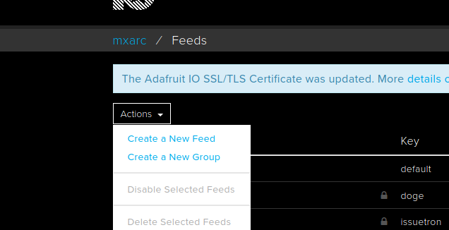
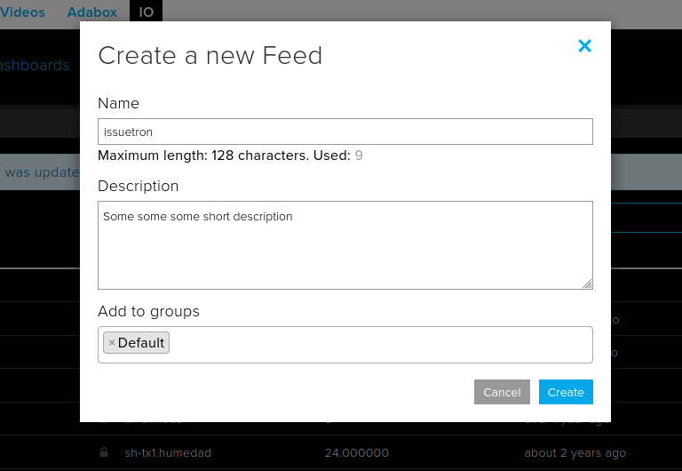
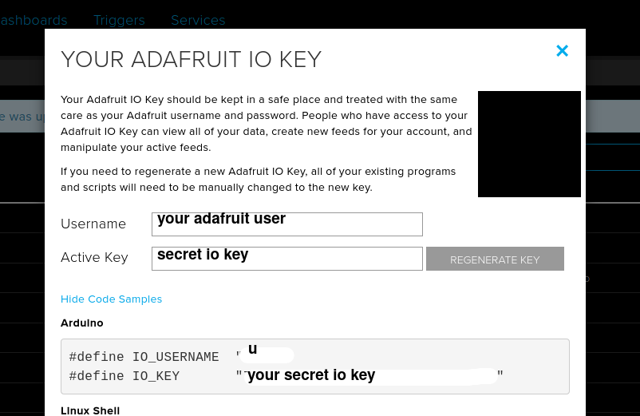
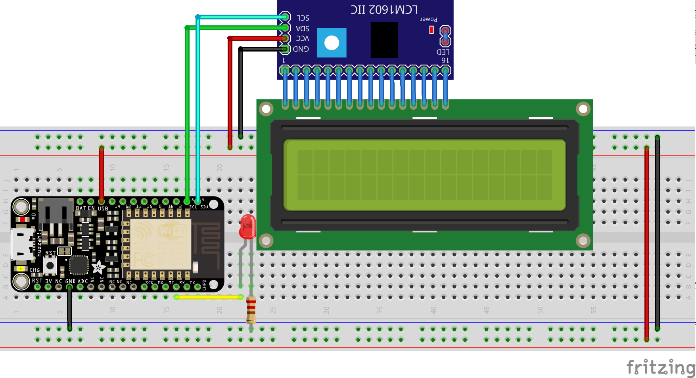

<p align="center">

</p>

# issuetron-3000 🚨

🚨 Turn on a light signal on the physical world when an issue is opened on one of your repos

This is my entry for the [dev.to GitHub Actions hackathon](https://dev.to/devteam/announcing-the-github-actions-hackathon-on-dev-3ljn)

## Index

- [issuetron-3000 🚨](#issuetron-3000-)
  - [Index](#index)
  - [About this](#about-this)
  - [How to use](#how-to-use)
  - [Requirements](#requirements)
  - [Setting up Adafruit IO](#setting-up-adafruit-io)
  - [Setting up your IoT device](#setting-up-your-iot-device)
  - [Setting up action](#setting-up-action)
  - [Trying the action](#trying-the-action)
  - [License](#license)

## About this

This is a really simple action intended to connect the real world with IoT devices connected to Adafruit IO Cloud.

It allows repo mantainers to keep alerted about new issues on their repos, made for the heros of the Open-Source 💙

🔧 I'm using Adafruit IO cloud for the ease of IoT development and device provisioning, since I know most people would like to configure a device the easy way and not have to go through complicated setups like AWS or Azure IoT.

The Action workflow is listening to an "Issue" event and when it's triggered it gets the issue context (like username and issue title) and sends the content over MQTT protocol to an ESP8266 device which I had lying around, it turns on a red lamp which I got from a auto parts store. 🚨

Action is able to send context about the issue, being those details:

    issue title
    issue author
    repo of origin

You can also disable the issue context if you want to save some bytes or you only want to trigger a custom action on your IoT device.

This action leverages repo secrets, since some variables like the device Key and ID are supposed to be secret, you can find more information on the README on how to setup your device.

## How to use

Example workflow file:

```yml
on:
issues:
  types: [opened]

jobs:
do_iot_thing:
  runs-on: ubuntu-latest
  name: A job to turn on a light when someone opens an issue
  steps:
    - name: Send activation to ESP8266 device
      uses: 'mxarc/issuetron-3000@1.1'
      id: activation
      with:
        time: '15' # how much time we will keep our light on
        blink: true # enable blinking, otherwise just turn on the lamp
        io_user: '${{ secrets.IO_USER }}'
        io_key: '${{ secrets.IO_KEY }}'
        io_feed: 'issuetron'
        send_context: true
    # Use the output from the `hello` step
    - name: Check if we succeeded to turn on the light
      run: echo "The result of the action is ${{ steps.activation.outputs.success }}"
```

## Requirements

- An Adafruit IO account
- A GitHub user account
- ESP8266 device
- LCD screen
- I2C Adapter for LCD screen (we need it to save space and pins)
- LED of any color
- 220ohm resistor
- Wires
- Internet connection
- 🍌 A banana (we will eat it, they're delicious!)

## Setting up Adafruit IO

1. Head over to <https://io.adafruit.com/> and create an account (Click Get started for free)
2. Once you create an account, sign in into io.adafruit.com
3. Create a new feed, name it "**issuetron**"
   
   
4. Once you create a new feed, click on "Adafruit IO Key" and save those values (you will need them later!)
   
   

## Setting up your IoT device

Now it's time to wire up the components, for the red LGB you could use another source of output, like a buzzer but it's up to you to modify the sketch.



Follow this sketch to connect your ESP8266 device

The next step is to upload the device code, you can find the code on the esp8266-code folder, I suggest you to use PlataformIO extension to make it easier to upload the code to your board.

You might need to find drivers for your esp8266 board, a quick Google search will get what you need.

Go to the `config.h` file and replace the next values with your actual device info and WiFi settings:

```c
// WiFi Settings
#define WLAN_SSID "<wifi name>"
#define WLAN_PASS "<wifi password>"

// Adafruit settings
#define AIO_USERNAME "<adafruit io username>"
#define AIO_KEY "<adafruit io key>"
```

## Setting up action

Add this [Workflow file](#how-to-use) to your .github workflows folder

I strongly suggest you to use Repo secrets to store the value of IO_KEY and IO_USER

## Trying the action

Once you completed the steps above, just open a new Issue and your device should alert you of a new opened issue :D

## License

[MIT](LICENSE)
